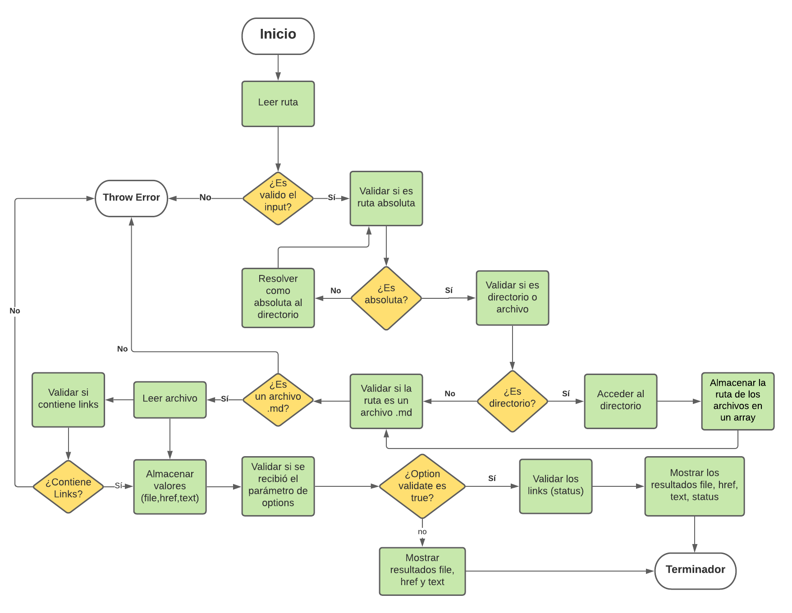

# Markdown Links

## Índice

* [1. Resumen](#1-resumen)
* [2. Diagrama de flujo](#2-diagrama-de-flujo)
* [3. Product Backlog](#3-product-backlog) 

***

## 1. Resumen

[Node.js](https://nodejs.org/es/) es un entorno de ejecución para JavaScript
construido con el [motor de JavaScript V8 de Chrome](https://developers.google.com/v8/).
Esto nos va a permitir ejecutar JavaScript en el entorno del sistema operativo,
ya sea tu máquina o un servidor, lo cual nos abre las puertas para poder
interactuar con el sistema en sí, archivos, redes, ...

En este proyecto nos alejamos un poco del navegador para construir un programa
que se ejecute usando Node.js, donde aprenderemos sobre cómo interactuar con el
sistema archivos, con el entorno (_proceso_, _env_, _stdin/stdout/stderr_), ...

En este proyecto crearás una herramienta de línea de comando (CLI) así como tu
propia librería (o biblioteca - library) en JavaScript.
 
## 2. Diagrama de flujo

### API
  
### CLI
  

## 3. Product Backlog

* Issues del proyecto

  *  Diagrama de flujo

## 4. Recursos de aprendizaje

[Asincronía](https://www.youtube.com/playlist?list=PLImOJ2OqvvkCuDi6E33HXMP23BvYYBHcm)
[Test Asincronía](https://www.pluralsight.com/guides/test-asynchronous-code-jest)
 
